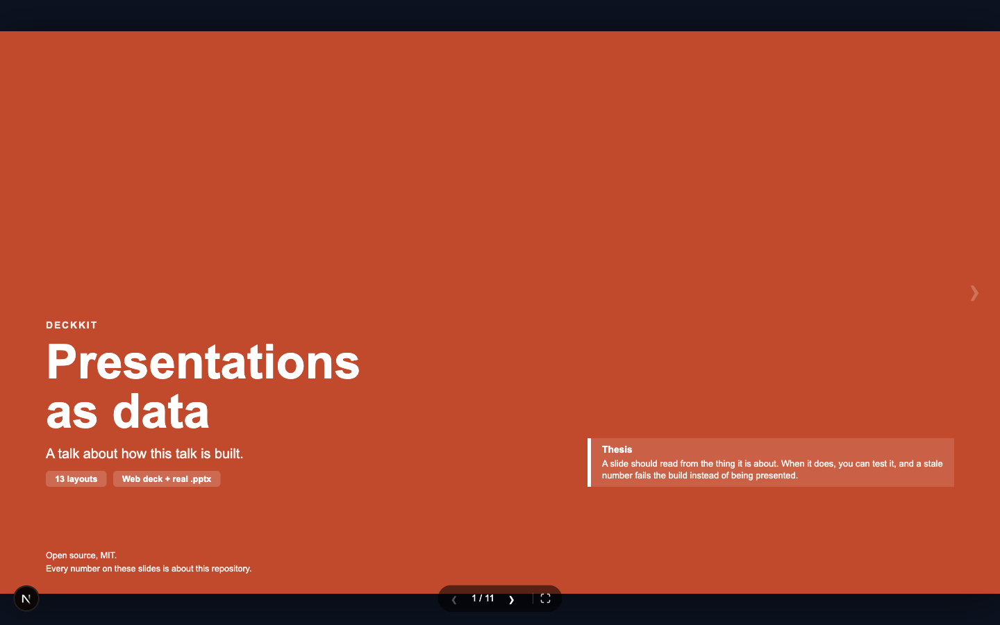
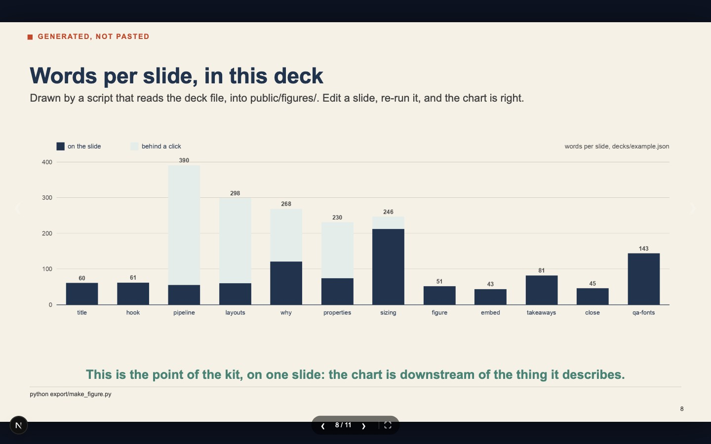
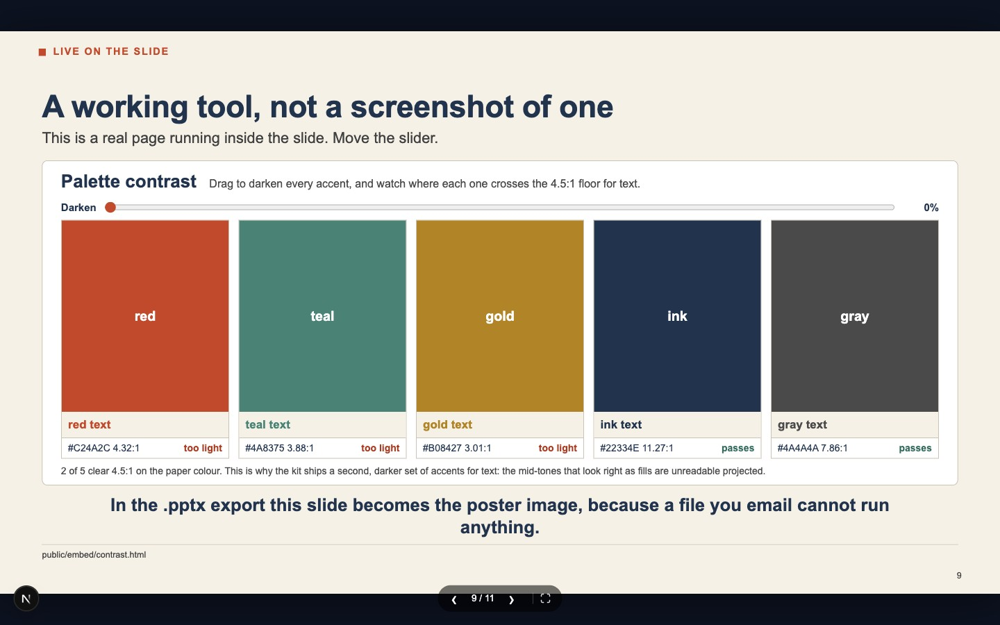

# DeckKit

Presentations as data. You write a JSON file; it renders as a keyboard-driven web deck in
the browser, and exports to a real `.pptx` — native shapes and text, not screenshots — and
to PDF. Both outputs read the same file, so they cannot disagree about what the talk says.



Extracted from a research talk that had to work three ways: live in a lecture theatre, as a
file a supervisor could open, and as a PDF an assessment system would accept. The research
is not here. The machinery is, with an example deck that explains itself.

```bash
npm install && npm run dev          # the deck at localhost:3000
npm test                            # check every slide against both renderers
./export/build.sh                   # figures -> build/example.pptx -> build/example.pdf
```

The example deck is a talk about how the example deck works, so the fastest way to learn
the format is to page through it with the JSON open beside you.

---

## Why bother

A figure exported into a slide file stops being connected to the analysis that produced it.
Nothing checks it again. The number in the deck and the number in your results are now two
facts, and one of them will quietly go out of date — usually the one you are about to show
a room.

When the deck is a file your tools can read, that stops being a discipline problem and
becomes a test:

```js
// tests/layouts.test.mjs — the version shipped here checks a line count.
// The version worth writing checks your results.
assert.equal(Number(claimed), actual,
  `the deck says ${claimed}; it is ${actual}. Update the slide.`)
```

A stale figure fails the build instead of being presented. You also get a readable `git
diff` of a talk, and a coding agent that can revise slide seven without opening slide one.

The trade is real and worth stating plainly. You give up transitions, dragging a box two
pixels left, and handing the file to a colleague who does not write code. Use this when
your slides make claims. Use a slide editor when they make an impression.

## What is in here

| Path | |
|---|---|
| `decks/example.json` | the deck. One file, the only thing most edits touch |
| `src/deck/activeDeck.ts` | the one place the deck file is named; `page.tsx` and `layout.tsx` both read it |
| `src/deck/deckTypes.ts` | slide/deck types and the palette. No React, so build scripts can import it |
| `src/deck/slideLayouts.tsx` | every layout, one `case` each |
| `src/deck/Deck.tsx` | the shell: paging, keyboard, fullscreen, overlays, and the CSS |
| `src/app/page.tsx` | six lines of Next.js that hand the JSON to the renderer |
| `export/build_pptx.py` | the same deck as a real `.pptx` |
| `export/build.sh` | figures → `.pptx` → PDF, in one command |
| `export/make_figure.py` | draws the chart on the `figure` slide, from the deck itself |
| `public/embed/contrast.html` | the live page the `embed` slide runs |
| `tests/layouts.test.mjs` | checks every slide against both renderers |

The renderer is 899 lines. It is meant to be read and changed, not configured.

## Writing a deck

A deck is `meta` plus a list of slides. Each slide names a `layout` and carries the fields
that layout wants:

```json
{
  "meta": { "docTitle": "…", "docSubtitle": "…", "author": "…" },
  "slides": [
    {
      "id": "properties",
      "layout": "metric-grid",
      "eyebrow": "What you get",
      "heading": "Four properties a slide file does not have",
      "metrics": [
        { "n": "1", "name": "Diffable", "detail": "Review a deck the way you review code.",
          "accent": "red", "more": "git diff on a deck shows you the sentence that changed…" }
      ],
      "bottomLine": "One line under the content, for the thing you want remembered.",
      "footer": "where this came from"
    }
  ]
}
```

Three fields do most of the work:

- **`more`** — on a table row, panel, metric or timeline stop. The slide stays sparse and a
  click opens the detail, which is where the answer to the awkward question lives.
- **`deck`** — same places as `more`, but takes a list of `{title, body}` and opens a small
  slide show inside the slide, for a question that needs three beats rather than one.
- **`appendix: true`** — takes the slide out of the main sequence and the page count. `M`
  jumps to the appendix, `Escape` returns you to where you were.
- **`depthOf`** — on an appendix slide, the `id` of the surface slide it belongs to. `M` then
  keys off the slide you are on and enters only that slide's depth, and the arrows page within
  it. Appendix slides without a `depthOf` stay one flat group, which is what `M` falls back to
  when the current slide has no depth of its own. Use `more` and `deck` when a click is fine
  and `depthOf` when it is not — on a call you want the backup material under one key, not
  somewhere in a shared appendix you have to page through while someone waits.

**Keys:** arrows, space, `PageUp`/`PageDown`, `Home`, `End` to move. `F` fullscreen.
`M` depth or appendix, `Escape` back.

### Layouts

`title` · `hook` · `timeline` · `two-card` · `two-panel` · `metric-grid` · `takeaways` ·
`table` · `equation` · `figure` · `embed` · `close` · `qa-backup`

Adding one is a `case` in `slideLayouts.tsx` and a function in `build_pptx.py`. The test
fails if you add it to only one of them.

Two are worth calling out:

**`figure`** takes a path under `public/`, so the browser and the exporter read the same
file. Point it at something a script writes and the chart cannot drift from the analysis.
`export/make_figure.py` is a worked example: it reads the deck and draws the chart the deck
displays.



**`embed`** runs a real page inside the slide, with a poster image behind it so a failed
load degrades to a screenshot rather than a blank box. In the `.pptx` the slide becomes the
poster, because a file you email cannot run anything.



## Exporting

```bash
./export/build.sh                        # decks/example.json
./export/build.sh decks/mine.json        # any deck
```

That runs three steps in order — figures, then `.pptx`, then PDF — because the `.pptx`
embeds the figures, and a stale chart baked into a file you emailed is worse than one on a
screen you can refresh. Or run the pieces yourself:

```bash
pip install -r export/requirements.txt   # python-pptx, pillow
python export/make_figure.py
python export/build_pptx.py decks/example.json build/example.pptx
soffice --headless --convert-to pdf --outdir build build/example.pptx
```

The PDF step needs LibreOffice (`brew install --cask libreoffice`). `build.sh` skips it
with a message if you do not have it; the `.pptx` opens in PowerPoint or Keynote and will
export a PDF from there.

`build_pptx.py` owns where the boxes go on a 13.333 × 7.5in stage; the deck file owns the
words. The two renderers lay the same talk out differently — the web deck runs a live tool
where the `.pptx` shows a still — but neither can change what it says.

## Making it yours

- **Palette.** Five accents and three tints at the top of `deckTypes.ts`, mirrored in
  `build_pptx.py`. Keep `ACCENT_TEXT` darker than `ACCENT`: the bright mid-tones that read
  well as fills disappear as text once projected. `public/embed/contrast.html` will tell you
  which of yours clear 4.5:1.
- **Photographs and logos.** Optional. Set `meta.assets` to `{titlePhoto, closePhoto,
  logoLight, logoDark}` and the title and closing slides put their accent panel over your
  photograph; leave it out and they render plainer. Nothing here ships anyone's branding.
- **Sizing.** Every dimension is in container units against a 16:9 stage, so the deck is
  identical on a laptop, a projector and a phone. One layout, scaled — not a responsive
  redesign that surprises you in the room. If you change the base margin, change it last.

## Licence

MIT. Fork it, replace the palette, delete the layouts you do not use.
